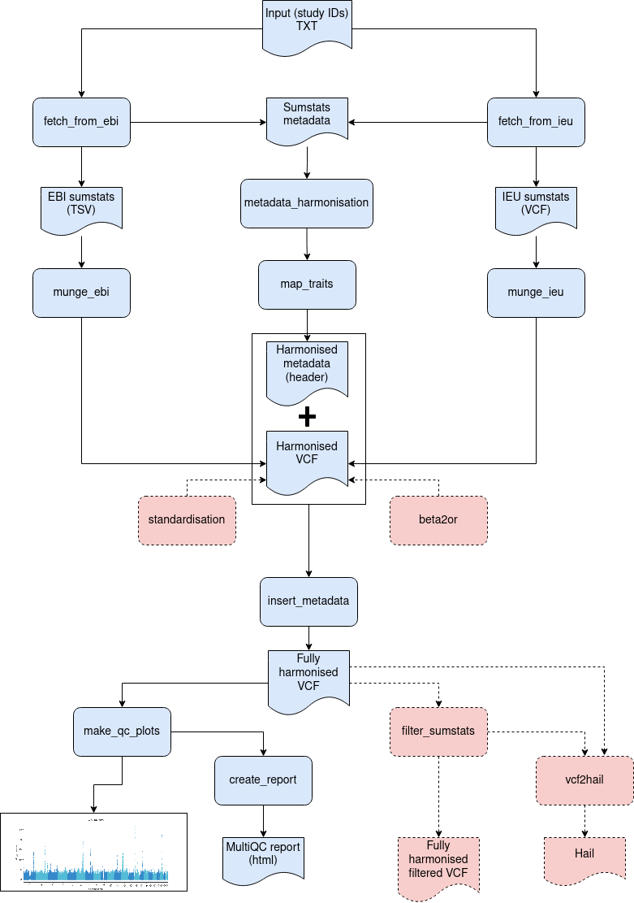

# Pipeline documentation

<ins>Table of contents</ins>

  - [1 - Pipeline description](#1---pipeline-description)
    - [1.1 - Pipeline overview](#11---pipeline-overview)
    - [1.2 - Input](#12---input)
    - [1.3 - Default processes](#13---default-processes)
    - [1.4 - Optional processes](#14---optional-processes)
    - [1.5 - Output](#15---output)
  - [2 - Options](#2---options)
  - [3 - Usage](#3---usage) 
    - [3.1 - Running with Docker or Singularity](#31---running-with-docker-or-singularity)
    - [3.2 - Execution examples](#32---execution-examples) 
  - [4 - Additional information](#4---additional-information) 
    - [4.1 - Stress testing](#41---stress-testing)
 
## 1 - <ins>Pipeline description</ins>

### 1.1 - <ins>Pipeline overview</ins>

  - Name: gwas-sumstats-harmonisation-nf
  - Tools: are listed in the environment.yml files in each respective tool bundle in the folder containers/<tool> in the repo.
  - Dependencies: are listed in the [docs/dependencies.md](docs/dependencies.md)

This pipeline is designed to fetch GWAS summary statistics from [EBI GWAS catalog](https://www.ebi.ac.uk/gwas/) and [IEU OpenGWAS](https://gwas.mrcieu.ac.uk/) and harmonise them to GWAS summary statistics VCF. Aditionally, this pipeline can also perform:

- **BETA** coefficient conversion to **Odds Ratio**.
- **BETA** and **BETA Standard Error** standardisation.
- Convert harmonised VCF to `Hail` format.
- Filter harmonised VCF.

The following diagram is a schematic representation of all the processes performed by this pipeline and their interconnections:





The diagram shows the default processes and output files in <span style="color:blue;">blue</span> and with solid lines. Optional processes and outputs are in <span style="color:red;">red</span> and with dashed lines.

### 1.2 - <ins>Input</ins>

This pipeline expects as input (indicated using `--input` parameter) the path (system file path, FTP or S3 bucket URI) to a text file containing the study IDs of the desired GWAS summary statistics. Studies can be collected from two different sources: [EBI GWAS catalog](https://www.ebi.ac.uk/gwas/) and [IEU OpenGWAS](https://gwas.mrcieu.ac.uk/). 

> NOTE: If EBI GWAS catalog is used as a source, only the GWAS studies for which harmonised datasets are available will be processed.

Input file should only contain IDs from a single source.

Example of input file for collecting EBI studies:

```
GCST001969
GCST90077560
``` 

Example of input file for collecting IEU studies:

```
ukb-b-14043
ieu-a-297
```

> NOTE: the optional parameter `--gwas_source` should be provided with one of the supported strings: "ebi" or "ieu" to indicate the database to search.


### 1.3 - <ins>Default processes</ins>

- `fetch_from_ebi` / `fetch_from_ieu`: one of these processes is used depending on the `--gwas_source` value, to collect the GWAS summary statistics and the available metadata from the specified studies.
- `munge_ebi` / `munge_ieu`: these processes uses the R package [`MungeSumstats`](http://www.bioconductor.org/packages/release/bioc/html/MungeSumstats.html) to process and harmonise the collected GWAS summary statistics files, converting them into a harmonised GWAS VCF file.
- `metadata_harmonisation`: harmonise the metadata obtained from both sources to a common format.
- `map_traits`: maps the available metadata traits to OMOP common data model.
- `insert_metadata`: inserts harmonised and mapped metadata into the harmonised VCF file.
- `make_qc_plots`: generate some plots from the harmonised VCF file.
- `create_report`: create an HTML report with the plots generated in the previous process.

### 1.4 - <ins>Optional processes</ins>

- `standardisation` [`--standardise true`]: performs BETA and SE standardisation and adds the standardised values to the output VCF.
- `beta2or` [`--coef_conversion true`]: performs BETA to Odds Ratio conversion and adds the Odds Ratio value to the output VCF.
- `filter_sumstats` [`--filter_beta_smaller_than`, `--filter_beta_greater_than`, `--filter_p_greater_than`, `--filter_freq_smaller_than`, `--filter_freq_greater_than`, `--filter_missing_info`, `--filter_info`]: performs different filterings to the harmonised VCF file. More details on each of the specific parameters can be found in the pipeline help (`nextflow run main.nf --help`, see [Options](#opt) section).
- `vcf2hail` [`--convert_to_hail true`]: converts harmonised VCF to [`Hail`](https://hail.is/docs/0.2/index.html) format.

### 1.5 - <ins>Output</ins>

The main output of this pipeline is a harmonised VCF file for each of the requested studies. They could be find in `results/harmonised` folder.

Example of harmonised VCF file:

```shell
##fileformat=VCFv4.1
##fileDate=20220322
##phasing=unphased
##genome_build=GRCh38
##source=VariantAnnotation 1.40.0
##FORMAT=<ID=AD,Number=2,Type=Integer,Description="Allelic depths (number of reads in each observed allele)">
##FORMAT=<ID=DP,Number=1,Type=Integer,Description="Total read depth">
##FORMAT=<ID=FT,Number=1,Type=String,Description="Variant filters">
##FORMAT=<ID=SNP,Number=1,Type=String,Description=".">
##FORMAT=<ID=BETA,Number=1,Type=Float,Description=".">
##FORMAT=<ID=FRQ,Number=1,Type=Float,Description=".">
##FORMAT=<ID=SE,Number=1,Type=Float,Description=".">
##FORMAT=<ID=P,Number=1,Type=Float,Description=".">
##FORMAT=<ID=STD_BETA,Number=1,Type=Float,Description="Standardised BETA">
##FORMAT=<ID=STD_BETA_SE,Number=1,Type=Float,Description="Standardised BETA SE">
##FORMAT=<ID=OR_,Number=1,Type=Float,Description="OR converted from BETA">
##contig=<ID=1>
##contig=<ID=2>
##contig=<ID=3>
##contig=<ID=4>
##contig=<ID=5>
##contig=<ID=6>
##contig=<ID=7>
##contig=<ID=8>
##contig=<ID=9>
##contig=<ID=10>
##contig=<ID=11>
##contig=<ID=12>
##contig=<ID=13>
##contig=<ID=14>
##contig=<ID=15>
##contig=<ID=16>
##contig=<ID=17>
##contig=<ID=18>
##contig=<ID=19>
##contig=<ID=20>
##contig=<ID=21>
##contig=<ID=22>
##meta=<pubmedId=23583979>
##meta=<title=Identification of heart rate-associated loci and their effects on cardiac conduction and rhythm disorders.>
##meta=<author=den Hoed M>
##meta=<publication=Nat Genet>
##meta=<publicationDate=2013-04-14>
##meta=<associationCount=32>
##meta=<note=NA>
##meta=<mr=NA>
##meta=<year=NA>
##meta=<group_name=NA>
##meta=<consortium=NA>
##meta=<sex=NA>
##meta=<priority=NA>
##meta=<population=NA>
##meta=<unit=NA>
##meta=<nsnp=NA>
##meta=<sample_size=NA>
##meta=<build=NA>
##meta=<id=GCST001969>
##meta=<subcategory=NA>
##meta=<category=NA>
##meta=<ontology=NA>
##meta=<trait=Heart rate>
##meta=<mappedLabel=heart rate>
##meta=<mappedUri=http://www.ebi.ac.uk/efo/EFO_0004326>
##trait=<reported="heart rate">
##trait=<source_origin="Inferred">
##trait=<source_concept_code="250764009">
##trait=<source_vocabulary="SNOMED">
##trait=<source_concept_id="40462158">
##trait=<source_concept_name="Heart rate">
##trait=<source_standard_concept="NA">
##trait=<concept_id="4239408">
##trait=<concept_code="364075005">
##trait=<concept_name="Heart rate">
##trait=<vocabulary="SNOMED">
##trait=<standard_concept="S">
##trait=<background_reported="NA">
##trait=<background_source_origin="NA">
##trait=<background_source_concept_code="NA">
##trait=<background_source_vocabulary="NA">
##trait=<background_source_concept_id="NA">
##trait=<background_source_concept_name="NA">
##trait=<background_concept_id="NA">
##trait=<background_concept_code="NA">
##trait=<background_concept_name="NA">
##trait=<background_vocabulary="NA">
##trait=<background_domain_name="NA">
##trait=<background_concept_class_name="NA">
##trait=<background_standard_concept="NA">
#CHROM	POS	ID	REF	ALT	QUAL	FILTER	INFO	FORMAT	GWAS
1	785910	.	G	C	.	.	.	SNP:BETA:FRQ:SE:P:STD_BETA:STD_BETA_SE:OR_	rs12565286:0.1632:0.0609:0.2577:0.5266:0.002836:0.004479:1.344486
1	788439	.	T	A	.	.	.	SNP:BETA:FRQ:SE:P:STD_BETA:STD_BETA_SE:OR_	rs11804171:0.141:0.0611:0.2581:0.5848:0.002451:0.004486:1.291424
1	788511	.	G	C	.	.	.	SNP:BETA:FRQ:SE:P:STD_BETA:STD_BETA_SE:OR_	rs2977670:-0.15:0.9379:0.2696:0.5779:-0.002607:0.004686:0.761801
```

This file contains the following data:

- Header: it will contain the inferred (by `MungeSumstats`) genome build, column descriptions, metadata collected and harmonised (`##meta` lines) and trait data mapped to OMOP (`##trait` lines).
- FORMAT and GWAS columns should contain at least the following fields:
    * SNP
    * BETA
    * SE
    * P

    The following fileds will be available depending on the original data and the options selected:
    * FRQ: ALT allele frequency. Will be present if available in the original data.
    * N: Study sample size. Will be present if available in the original metadata.
    * STD_BETA: standardised BETA (if `--standardsise true`).
    * STD_BETA_SE: standardised BETA Standard Error (if `--standardise true`).
    * OR_: Odds Ratio converted from BETA coefficient (if `--coef_conversion true`).

Other output:

- `results/QC_plots`: several plots and descriptive statistics files.
- `results/MultiQC`: `<study_id>_multiqc_report.html` files (one per study) as multiQC reports, with the plots available in `results/QC_plots`.
- `results/conversion`: it will keep a copy of the harmonised VCF after BETA to OR conversion and/or standardisation.
- `results/<ebi | ieu>`: it will keep a copy of the original summary statistics files downloaded from the source as well as the extracted metadata and the first harmonisation using `MungeSumstats`. Only present if `--keep_intermediate_files true`.
- `results/metadata`: harmonised metadata and mapped metadata traits files. Only present if `--keep_intermediate_files true`.
- `results/harmonised/filtered`: fully harmonised and filtered VCF.
- `results/harmonised/hail`: harmonised (and filtered if requested) GWAS summary statistics converted to `Hail` matrix format.


## 2 - <ins>Options</ins>
<a name="opt"></a>
See pipeline help (`nextflow run main.nf --help`) for a detailed explanation of the available options:

```

Usage:
The typical command for running the pipeline is as follows:
nextflow run main.nf --input input.txt [Options]

Inputs:
--input                    Input file (path). It expects a study ID per line file.

Options:
--gwas_source              GWAS source from where to fetch the data. It should be one of
                           the following supported strings: 'ebi', 'ieu'.
                           (default: null)
--standardise              Whether to perform the BETA and SE standardisation (bool)
                           (default: false)
--coef_conversion          Whether to perform the coefficient conversion, from BETA
                           to Odds Ratio (bool)
                           (default: false) 
--miss_percent_allow       Missigness percentage allowed for a column from EBI data. Each
                           column above this percentage will be dropped (int / float)
                           (default: 10)
--keep_intermediate_files  Whether to keep intermediate files (bool)
                           (default: false)
--omop_vocabulary          Path or link to an OMOP vocabulary DB file (path)
                           (default: https://omopvocabs.s3.eu-west-1.amazonaws.com/omop_vocabulary.db)
--convert_to_hail          Whether to convert the harmonised VCF to Hail MatrixTable format (bool)
                           (default: false)
--med_memory               Memory assignment for the more memory intensive tasks (string)
                           (default: 9.GB)
--take_n_studies           Take n studies from the given input file to run the pipeline (int)
                            (default: $params.take_n_studies)

GWAS filtering options:
--filter_beta_smaller_than  Exclude variants with BETA smaller than the specified value (float)
                            (Default: null)
--filter_beta_greater_than  Exclude variants with BETA greater than the specified value (float)
                            (Default: null)
--filter_p_greater_than     Exclude variants with a P value greater than the specified value (float)
                            (Default: null)
--filter_freq_smaller_than  Exclude variants with a alternate allele frequency smaller than the specified
                            value. (float)
                            (Default: null)
--filter_freq_greater_than  Exclude variants with a alternate allele frequency greater than the specified
                            value. (float)
                            (Default: null)
--filter_missing_info       Exclude variants with a missing value for INFO column (bool)
                            (Default: false)
--filter_info               Exclude variants with a INFO value smaller than the one specified (float).
                            (Default: null)

Resource options:
--max_cpus         Maximum number of CPUs (int)
                   (default: 2)  
--max_memory       Maximum memory (memory unit)
                   (default: 16 GB)
--max_time         Maximum time (time unit)
                   (default: 8h)
--outdir           Output directory(path)
                   (default: results)

```

## 3 - <ins>Usage</ins>  

Inside the folder [conf/](./conf) pre-curated configurations of parameters to execute the pipeline in different modes are provided.
Every configuration file can be run, from the root of the local clone of the repository, using one of the following commands.

> NOTE: Adding `-with-docker` or `-with-singularity` is required because all of the dependencies are used from the containers.
> NOTE: It is recommended to increase value supplied via `--med_memory` parameter as munging steps require a fairly large amount of memory.

### 3.1 - <ins>Running with Docker or Singularity</ins>
## Running with Docker

```bash
nextflow run main.nf --config conf/<any-config> -with-docker
```
Example:

```bash
nextflow run main.nf --config conf/test_ebi.config --med_memory 9.GB -with-docker
```

## Running with Singularity

```bash
nextflow run main.nf --config conf/<any-config> -with-singularity
```
Example:

```bash
nextflow run main.nf --config conf/test_ebi.config --med_memory 9.GB -with-singularity
```

### 3.2 - <ins>Execution examples</ins>
   
#### Harmonising GWAS summary statistics from EBI GWAS catalogue

```bash
nextflow run main.nf --config conf/test_ebi.config --med_memory 9.GB -with-docker
nextflow run main.nf --config conf/test_ebi.config --med_memory 9.GB -with-singularity
```

Expected output:

```
tree -fh results/
results
├── [4.0K]  results/MultiQC
│   ├── [5.6M]  results/MultiQC/GCST001969_multiqc_report.html
│   └── [5.6M]  results/MultiQC/multiqc_report.html
├── [4.0K]  results/QC_plots
│   └── [4.0K]  results/QC_plots/GCST001969
│       ├── [ 76K]  results/QC_plots/GCST001969/Manhattan.png
│       ├── [ 27K]  results/QC_plots/GCST001969/QQ.png
│       ├── [ 37K]  results/QC_plots/GCST001969/boxPlot-maf-beta.png
│       ├── [ 32K]  results/QC_plots/GCST001969/boxPlot-maf-p.png
│       ├── [4.5K]  results/QC_plots/GCST001969/descriptive_statistics.tsv
│       ├── [9.6K]  results/QC_plots/GCST001969/descriptive_statistics.txt
│       ├── [ 30K]  results/QC_plots/GCST001969/frequencyCurve-Absolute_beta.png
│       ├── [ 34K]  results/QC_plots/GCST001969/frequencyCurve-MAF.png
│       ├── [ 27K]  results/QC_plots/GCST001969/scatterPlot-beta-logp.png
│       ├── [ 24K]  results/QC_plots/GCST001969/scatterPlot-maf-beta.png
│       └── [ 32K]  results/QC_plots/GCST001969/scatterPlot-maf-p.png
├── [4.0K]  results/conversion
│   └── [306M]  results/conversion/GCST001969_harmonised_conv_sumstats.vcf
├── [4.0K]  results/ebi
│   ├── [102M]  results/ebi/23583979-GCST001969-EFO_0004326.h.tsv.gz
│   ├── [186M]  results/ebi/GCST001969_harmonised_sumstats.vcf
│   └── [ 361]  results/ebi/GCST001969_metadata_ebi.tsv
├── [4.0K]  results/harmonised
│   ├── [306M]  results/harmonised/GCST001969_fully_harmonised_sumstats.vcf
│   ├── [4.0K]  results/harmonised/filtered
│   │   └── [ 67M]  results/harmonised/filtered/GCST001969_harmonised_filtered_sumstats.vcf
│   └── [4.0K]  results/harmonised/hail
│       └── [4.0K]  results/harmonised/hail/GCST001969_hail_matrix.mt
│           ├── [ 147]  results/harmonised/hail/GCST001969_hail_matrix.mt/README.txt
│           ├── [   0]  results/harmonised/hail/GCST001969_hail_matrix.mt/_SUCCESS
│           ├── [4.0K]  results/harmonised/hail/GCST001969_hail_matrix.mt/cols
│           │   ├── [ 147]  results/harmonised/hail/GCST001969_hail_matrix.mt/cols/README.txt
│           │   ├── [   0]  results/harmonised/hail/GCST001969_hail_matrix.mt/cols/_SUCCESS
│           │   ├── [ 261]  results/harmonised/hail/GCST001969_hail_matrix.mt/cols/metadata.json.gz
│           │   └── [4.0K]  results/harmonised/hail/GCST001969_hail_matrix.mt/cols/rows
│           │       ├── [ 252]  results/harmonised/hail/GCST001969_hail_matrix.mt/cols/rows/metadata.json.gz
│           │       └── [4.0K]  results/harmonised/hail/GCST001969_hail_matrix.mt/cols/rows/parts
│           │           └── [  17]  results/harmonised/hail/GCST001969_hail_matrix.mt/cols/rows/parts/part-0
│           ├── [4.0K]  results/harmonised/hail/GCST001969_hail_matrix.mt/entries
│           │   ├── [ 147]  results/harmonised/hail/GCST001969_hail_matrix.mt/entries/README.txt
│           │   ├── [   0]  results/harmonised/hail/GCST001969_hail_matrix.mt/entries/_SUCCESS
│           │   ├── [ 369]  results/harmonised/hail/GCST001969_hail_matrix.mt/entries/metadata.json.gz
│           │   └── [4.0K]  results/harmonised/hail/GCST001969_hail_matrix.mt/entries/rows
│           │       ├── [ 674]  results/harmonised/hail/GCST001969_hail_matrix.mt/entries/rows/metadata.json.gz
│           │       └── [4.0K]  results/harmonised/hail/GCST001969_hail_matrix.mt/entries/rows/parts
│           │           └── [ 20M]  results/harmonised/hail/GCST001969_hail_matrix.mt/entries/rows/parts/part-0-c8fd83fb-76e0-420c-90b1-31f9ec3ad4f0
│           ├── [4.0K]  results/harmonised/hail/GCST001969_hail_matrix.mt/globals
│           │   ├── [ 147]  results/harmonised/hail/GCST001969_hail_matrix.mt/globals/README.txt
│           │   ├── [   0]  results/harmonised/hail/GCST001969_hail_matrix.mt/globals/_SUCCESS
│           │   ├── [4.0K]  results/harmonised/hail/GCST001969_hail_matrix.mt/globals/globals
│           │   │   ├── [ 240]  results/harmonised/hail/GCST001969_hail_matrix.mt/globals/globals/metadata.json.gz
│           │   │   └── [4.0K]  results/harmonised/hail/GCST001969_hail_matrix.mt/globals/globals/parts
│           │   │       └── [  11]  results/harmonised/hail/GCST001969_hail_matrix.mt/globals/globals/parts/part-0
│           │   ├── [ 253]  results/harmonised/hail/GCST001969_hail_matrix.mt/globals/metadata.json.gz
│           │   └── [4.0K]  results/harmonised/hail/GCST001969_hail_matrix.mt/globals/rows
│           │       ├── [ 240]  results/harmonised/hail/GCST001969_hail_matrix.mt/globals/rows/metadata.json.gz
│           │       └── [4.0K]  results/harmonised/hail/GCST001969_hail_matrix.mt/globals/rows/parts
│           │           └── [  11]  results/harmonised/hail/GCST001969_hail_matrix.mt/globals/rows/parts/part-0
│           ├── [4.0K]  results/harmonised/hail/GCST001969_hail_matrix.mt/index
│           │   └── [4.0K]  results/harmonised/hail/GCST001969_hail_matrix.mt/index/part-0-c8fd83fb-76e0-420c-90b1-31f9ec3ad4f0.idx
│           │       ├── [6.9M]  results/harmonised/hail/GCST001969_hail_matrix.mt/index/part-0-c8fd83fb-76e0-420c-90b1-31f9ec3ad4f0.idx/index
│           │       └── [ 206]  results/harmonised/hail/GCST001969_hail_matrix.mt/index/part-0-c8fd83fb-76e0-420c-90b1-31f9ec3ad4f0.idx/metadata.json.gz
│           ├── [ 391]  results/harmonised/hail/GCST001969_hail_matrix.mt/metadata.json.gz
│           ├── [4.0K]  results/harmonised/hail/GCST001969_hail_matrix.mt/references
│           └── [4.0K]  results/harmonised/hail/GCST001969_hail_matrix.mt/rows
│               ├── [ 147]  results/harmonised/hail/GCST001969_hail_matrix.mt/rows/README.txt
│               ├── [   0]  results/harmonised/hail/GCST001969_hail_matrix.mt/rows/_SUCCESS
│               ├── [ 325]  results/harmonised/hail/GCST001969_hail_matrix.mt/rows/metadata.json.gz
│               └── [4.0K]  results/harmonised/hail/GCST001969_hail_matrix.mt/rows/rows
│                   ├── [ 637]  results/harmonised/hail/GCST001969_hail_matrix.mt/rows/rows/metadata.json.gz
│                   └── [4.0K]  results/harmonised/hail/GCST001969_hail_matrix.mt/rows/rows/parts
│                       └── [3.3M]  results/harmonised/hail/GCST001969_hail_matrix.mt/rows/rows/parts/part-0-c8fd83fb-76e0-420c-90b1-31f9ec3ad4f0
├── [4.0K]  results/metadata
│   ├── [ 706]  results/metadata/GCST001969_harmonised_metadata.txt
│   └── [1.6K]  results/metadata/GCST001969_mapped_metadata.txt
└── [4.0K]  results/pipeline_info
    ├── [2.8M]  results/pipeline_info/execution_report_2022-03-16_18-50-19.html
    ├── [249K]  results/pipeline_info/execution_timeline_2022-03-16_18-50-19.html
    ├── [1.6K]  results/pipeline_info/execution_trace_2022-03-16_18-50-19.txt
    └── [ 799]  results/pipeline_info/pipeline_metadata_report.tsv

28 directories, 52 files
```
Format of main output:
```shell
head -n10 results/harmonised/GCST001969_fully_harmonised_sumstats.vcf

##fileformat=VCFv4.1
##fileDate=20220322
##phasing=unphased
##genome_build=GRCh38
##source=VariantAnnotation 1.40.0
##FORMAT=<ID=AD,Number=2,Type=Integer,Description="Allelic depths (number of reads in each observed allele)">
##FORMAT=<ID=DP,Number=1,Type=Integer,Description="Total read depth">
##FORMAT=<ID=FT,Number=1,Type=String,Description="Variant filters">
##FORMAT=<ID=SNP,Number=1,Type=String,Description=".">
##FORMAT=<ID=BETA,Number=1,Type=Float,Description=".">
```

#### Harmonising GWAS summary statistics from IEU Open GWAS project

```bash
nextflow run main.nf --config conf/test_ieu.config --med_memory 9.GB -with-docker
nextflow run main.nf --config conf/test_ieu.config --med_memory 9.GB -with-singularity
```

#### Harmonising GWAS summary statistics from EBI GWAS catalogue

```bash
nextflow run main.nf --config conf/test_ebi_basic.config --med_memory 9.GB -with-docker
nextflow run main.nf --config conf/test_ebi_basic.config --med_memory 9.GB -with-singularity
```

## 4 - <ins>Additional information</ins>

### 4.1 - <ins>Stress testing</ins>
## Running with cloudos-cli to submit to CloudOS platform on AWS

### Set up of environmental variables

This step only needs to be set up once. More detailed information for the `cloudos-cli` package required and optional parameters can be found in the official documentation, at https://github.com/lifebit-ai/cloudos-cli.

```bash
# Workspace specific variables
MY_API_KEY="**"
WORKSPACE_ID="**"
CLOUDOS_URL="**"
PROJECT_NAME="**"

# Workflow specific variables
WORKFLOW_NAME="bi-gwas-sumstats-harmonisation-nf"
MED_MEMORY="9.GB"
INSTANCE_TYPE="c3.4xlarge"

CLOUDOS_CLI_OPTIONS=" --cloudos-url $CLOUDOS_URL --apikey $MY_API_KEY --workspace-id $WORKSPACE_ID --workflow-name $WORKFLOW_NAME --project-name $PROJECT_NAME --parameter med_memory=${MED_MEMORY} --instance-type $INSTANCE_TYPE"
CLOUDOS_CLI_OPTIONS+=" --resumable --spot"
```

### Installation of `cloudos-cli`

General installation instructions can be found in https://github.com/lifebit-ai/cloudos-cli#from-github.

#### Pre-installed cloudos-cli in the HPC

Ask from your system administrator to install the package based on the official documentation. If already available in your system, you can type the commands below to verify that the package is successfully installed:

```bash
ml load cloudos
cloudos --version
```

The output will display the version of `cloudos-cli` you are using.

```console
cloudos, version <SELECTED VERSION IN USE>
```

#### Running from pre-build docker image

> NOTE: For convenience and ensuring the commands are being executing from the same network as the jobs that will be submitted, to ensure access to Lifebit CloudOS services is successful, you can use a terminal in a JupyterLab session within the Lifebit CloudOS platform. Docker is already available, and hence you can use the `cloudos-cli` from the pre-built image that is provided in the `cloudos-cli` documentation.

```bash
docker run --rm -it quay.io/lifebitaiorg/cloudos-cli:<TAG>
```

### Execution command

After passing all the required environmental variables in $CLOUDOS_CLI_OPTIONS, the command to submit programmatically a job to the Lifebit CloudOS Platform can be condensed to:

```bash
cloudos job run --nextflow-profile <any-profile> $CLOUDOS_CLI_OPTIONS
```

### Example configurations for testing specific modes of the pipeline

### Harmonising GWAS summary statistics from EBI GWAS catalogue

```bash
nextflow run main.nf --config conf/test_ebi.config --med_memory 9.GB -with-docker
nextflow run main.nf --config conf/test_ebi.config --med_memory 9.GB -with-singularity
cloudos job run --nextflow-profile test_ebi $CLOUDOS_CLI_OPTIONS
```

<details>
<summary>Expected output:</summary>

```
.
├── [  53]  ./conversion
│   └── [325M]  ./conversion/GCST001969_harmonised_conv_sumstats.vcf
├── [ 165]  ./ebi
│   ├── [102M]  ./ebi/23583979-GCST001969-EFO_0004326.h.tsv.gz
│   ├── [204M]  ./ebi/GCST001969_harmonised_sumstats.vcf
│   ├── [ 379]  ./ebi/GCST001969_metadata_ebi.tsv
│   └── [   6]  ./ebi/GCST001969_sample_size.txt
├── [  82]  ./harmonised
│   ├── [  57]  ./harmonised/filtered
│   │   └── [ 71M]  ./harmonised/filtered/GCST001969_harmonised_filtered_sumstats.vcf
│   ├── [325M]  ./harmonised/GCST001969_fully_harmonised_sumstats.vcf
│   └── [  39]  ./harmonised/hail
│       └── [ 131]  ./harmonised/hail/GCST001969_hail_matrix.mt
│           ├── [ 149]  ./harmonised/hail/GCST001969_hail_matrix.mt/cols
│           │   ├── [ 261]  ./harmonised/hail/GCST001969_hail_matrix.mt/cols/metadata.json.gz
│           │   ├── [  12]  ./harmonised/hail/GCST001969_hail_matrix.mt/cols/.metadata.json.gz.crc
│           │   ├── [ 147]  ./harmonised/hail/GCST001969_hail_matrix.mt/cols/README.txt
│           │   ├── [  12]  ./harmonised/hail/GCST001969_hail_matrix.mt/cols/.README.txt.crc
│           │   ├── [  72]  ./harmonised/hail/GCST001969_hail_matrix.mt/cols/rows
│           │   │   ├── [ 252]  ./harmonised/hail/GCST001969_hail_matrix.mt/cols/rows/metadata.json.gz
│           │   │   ├── [  12]  ./harmonised/hail/GCST001969_hail_matrix.mt/cols/rows/.metadata.json.gz.crc
│           │   │   └── [  39]  ./harmonised/hail/GCST001969_hail_matrix.mt/cols/rows/parts
│           │   │       ├── [  17]  ./harmonised/hail/GCST001969_hail_matrix.mt/cols/rows/parts/part-0
│           │   │       └── [  12]  ./harmonised/hail/GCST001969_hail_matrix.mt/cols/rows/parts/.part-0.crc
│           │   ├── [   0]  ./harmonised/hail/GCST001969_hail_matrix.mt/cols/_SUCCESS
│           │   └── [   8]  ./harmonised/hail/GCST001969_hail_matrix.mt/cols/._SUCCESS.crc
│           ├── [ 149]  ./harmonised/hail/GCST001969_hail_matrix.mt/entries
│           │   ├── [ 371]  ./harmonised/hail/GCST001969_hail_matrix.mt/entries/metadata.json.gz
│           │   ├── [  12]  ./harmonised/hail/GCST001969_hail_matrix.mt/entries/.metadata.json.gz.crc
│           │   ├── [ 147]  ./harmonised/hail/GCST001969_hail_matrix.mt/entries/README.txt
│           │   ├── [  12]  ./harmonised/hail/GCST001969_hail_matrix.mt/entries/.README.txt.crc
│           │   ├── [  72]  ./harmonised/hail/GCST001969_hail_matrix.mt/entries/rows
│           │   │   ├── [ 682]  ./harmonised/hail/GCST001969_hail_matrix.mt/entries/rows/metadata.json.gz
│           │   │   ├── [  16]  ./harmonised/hail/GCST001969_hail_matrix.mt/entries/rows/.metadata.json.gz.crc
│           │   │   └── [ 113]  ./harmonised/hail/GCST001969_hail_matrix.mt/entries/rows/parts
│           │   │       ├── [ 21M]  ./harmonised/hail/GCST001969_hail_matrix.mt/entries/rows/parts/part-0-3c164dfc-9487-4f34-b4a3-5654a650e243
│           │   │       └── [165K]  ./harmonised/hail/GCST001969_hail_matrix.mt/entries/rows/parts/.part-0-3c164dfc-9487-4f34-b4a3-5654a650e243.crc
│           │   ├── [   0]  ./harmonised/hail/GCST001969_hail_matrix.mt/entries/_SUCCESS
│           │   └── [   8]  ./harmonised/hail/GCST001969_hail_matrix.mt/entries/._SUCCESS.crc
│           ├── [ 164]  ./harmonised/hail/GCST001969_hail_matrix.mt/globals
│           │   ├── [  72]  ./harmonised/hail/GCST001969_hail_matrix.mt/globals/globals
│           │   │   ├── [ 240]  ./harmonised/hail/GCST001969_hail_matrix.mt/globals/globals/metadata.json.gz
│           │   │   ├── [  12]  ./harmonised/hail/GCST001969_hail_matrix.mt/globals/globals/.metadata.json.gz.crc
│           │   │   └── [  39]  ./harmonised/hail/GCST001969_hail_matrix.mt/globals/globals/parts
│           │   │       ├── [  11]  ./harmonised/hail/GCST001969_hail_matrix.mt/globals/globals/parts/part-0
│           │   │       └── [  12]  ./harmonised/hail/GCST001969_hail_matrix.mt/globals/globals/parts/.part-0.crc
│           │   ├── [ 253]  ./harmonised/hail/GCST001969_hail_matrix.mt/globals/metadata.json.gz
│           │   ├── [  12]  ./harmonised/hail/GCST001969_hail_matrix.mt/globals/.metadata.json.gz.crc
│           │   ├── [ 147]  ./harmonised/hail/GCST001969_hail_matrix.mt/globals/README.txt
│           │   ├── [  12]  ./harmonised/hail/GCST001969_hail_matrix.mt/globals/.README.txt.crc
│           │   ├── [  72]  ./harmonised/hail/GCST001969_hail_matrix.mt/globals/rows
│           │   │   ├── [ 240]  ./harmonised/hail/GCST001969_hail_matrix.mt/globals/rows/metadata.json.gz
│           │   │   ├── [  12]  ./harmonised/hail/GCST001969_hail_matrix.mt/globals/rows/.metadata.json.gz.crc
│           │   │   └── [  39]  ./harmonised/hail/GCST001969_hail_matrix.mt/globals/rows/parts
│           │   │       ├── [  11]  ./harmonised/hail/GCST001969_hail_matrix.mt/globals/rows/parts/part-0
│           │   │       └── [  12]  ./harmonised/hail/GCST001969_hail_matrix.mt/globals/rows/parts/.part-0.crc
│           │   ├── [   0]  ./harmonised/hail/GCST001969_hail_matrix.mt/globals/_SUCCESS
│           │   └── [   8]  ./harmonised/hail/GCST001969_hail_matrix.mt/globals/._SUCCESS.crc
│           ├── [  61]  ./harmonised/hail/GCST001969_hail_matrix.mt/index
│           │   └── [  90]  ./harmonised/hail/GCST001969_hail_matrix.mt/index/part-0-3c164dfc-9487-4f34-b4a3-5654a650e243.idx
│           │       ├── [6.9M]  ./harmonised/hail/GCST001969_hail_matrix.mt/index/part-0-3c164dfc-9487-4f34-b4a3-5654a650e243.idx/index
│           │       ├── [ 56K]  ./harmonised/hail/GCST001969_hail_matrix.mt/index/part-0-3c164dfc-9487-4f34-b4a3-5654a650e243.idx/.index.crc
│           │       ├── [ 205]  ./harmonised/hail/GCST001969_hail_matrix.mt/index/part-0-3c164dfc-9487-4f34-b4a3-5654a650e243.idx/metadata.json.gz
│           │       └── [  12]  ./harmonised/hail/GCST001969_hail_matrix.mt/index/part-0-3c164dfc-9487-4f34-b4a3-5654a650e243.idx/.metadata.json.gz.crc
│           ├── [ 393]  ./harmonised/hail/GCST001969_hail_matrix.mt/metadata.json.gz
│           ├── [ 147]  ./harmonised/hail/GCST001969_hail_matrix.mt/README.txt
│           ├── [ 149]  ./harmonised/hail/GCST001969_hail_matrix.mt/rows
│           │   ├── [ 326]  ./harmonised/hail/GCST001969_hail_matrix.mt/rows/metadata.json.gz
│           │   ├── [  12]  ./harmonised/hail/GCST001969_hail_matrix.mt/rows/.metadata.json.gz.crc
│           │   ├── [ 147]  ./harmonised/hail/GCST001969_hail_matrix.mt/rows/README.txt
│           │   ├── [  12]  ./harmonised/hail/GCST001969_hail_matrix.mt/rows/.README.txt.crc
│           │   ├── [  72]  ./harmonised/hail/GCST001969_hail_matrix.mt/rows/rows
│           │   │   ├── [ 637]  ./harmonised/hail/GCST001969_hail_matrix.mt/rows/rows/metadata.json.gz
│           │   │   ├── [  16]  ./harmonised/hail/GCST001969_hail_matrix.mt/rows/rows/.metadata.json.gz.crc
│           │   │   └── [ 113]  ./harmonised/hail/GCST001969_hail_matrix.mt/rows/rows/parts
│           │   │       ├── [3.3M]  ./harmonised/hail/GCST001969_hail_matrix.mt/rows/rows/parts/part-0-3c164dfc-9487-4f34-b4a3-5654a650e243
│           │   │       └── [ 26K]  ./harmonised/hail/GCST001969_hail_matrix.mt/rows/rows/parts/.part-0-3c164dfc-9487-4f34-b4a3-5654a650e243.crc
│           │   ├── [   0]  ./harmonised/hail/GCST001969_hail_matrix.mt/rows/_SUCCESS
│           │   └── [   8]  ./harmonised/hail/GCST001969_hail_matrix.mt/rows/._SUCCESS.crc
│           └── [   0]  ./harmonised/hail/GCST001969_hail_matrix.mt/_SUCCESS
├── [  86]  ./metadata
│   ├── [ 709]  ./metadata/GCST001969_harmonised_metadata.txt
│   └── [1.7K]  ./metadata/GCST001969_mapped_metadata.txt
├── [  71]  ./MultiQC
│   ├── [5.6M]  ./MultiQC/GCST001969_multiqc_report.html
│   └── [5.6M]  ./MultiQC/multiqc_report.html
├── [ 189]  ./pipeline_info
│   ├── [2.8M]  ./pipeline_info/execution_report_2022-09-09_15-40-58.html
│   ├── [8.5K]  ./pipeline_info/execution_timeline_2022-09-09_15-40-58.html
│   ├── [1.6K]  ./pipeline_info/execution_trace_2022-09-09_15-57-25.txt
│   └── [1.5K]  ./pipeline_info/pipeline_metadata_report.tsv
└── [  24]  ./QC_plots
    └── [ 326]  ./QC_plots/GCST001969
        ├── [ 37K]  ./QC_plots/GCST001969/boxPlot-maf-beta.png
        ├── [ 32K]  ./QC_plots/GCST001969/boxPlot-maf-p.png
        ├── [4.5K]  ./QC_plots/GCST001969/descriptive_statistics.tsv
        ├── [9.6K]  ./QC_plots/GCST001969/descriptive_statistics.txt
        ├── [ 30K]  ./QC_plots/GCST001969/frequencyCurve-Absolute_beta.png
        ├── [ 34K]  ./QC_plots/GCST001969/frequencyCurve-MAF.png
        ├── [ 76K]  ./QC_plots/GCST001969/Manhattan.png
        ├── [ 27K]  ./QC_plots/GCST001969/QQ.png
        ├── [ 27K]  ./QC_plots/GCST001969/scatterPlot-beta-logp.png
        ├── [ 24K]  ./QC_plots/GCST001969/scatterPlot-maf-beta.png
        └── [ 32K]  ./QC_plots/GCST001969/scatterPlot-maf-p.png

27 directories, 77 files
```
</details>
<br>

CloudOS Example run: https://staging.lifebit.ai/app/jobs/631b5e1ab2b00e0155865e92

### Harmonising GWAS summary statistics from IEU Open GWAS project

```bash
nextflow run main.nf --config conf/test_ieu.config --med_memory 9.GB -with-docker
nextflow run main.nf --config conf/test_ieu.config --med_memory 9.GB -with-singularity
cloudos job run --nextflow-profile test_ieu $CLOUDOS_CLI_OPTIONS
```
<details>
<summary>Expected output:</summary>

```
.
├── [  54]  ./conversion
│   └── [462M]  ./conversion/ukb-b-14043_harmonised_conv_sumstats.vcf
├── [  83]  ./harmonised
│   ├── [  58]  ./harmonised/filtered
│   │   └── [154M]  ./harmonised/filtered/ukb-b-14043_harmonised_filtered_sumstats.vcf
│   ├── [  40]  ./harmonised/hail
│   │   └── [ 131]  ./harmonised/hail/ukb-b-14043_hail_matrix.mt
│   │       ├── [ 149]  ./harmonised/hail/ukb-b-14043_hail_matrix.mt/cols
│   │       │   ├── [ 261]  ./harmonised/hail/ukb-b-14043_hail_matrix.mt/cols/metadata.json.gz
│   │       │   ├── [  12]  ./harmonised/hail/ukb-b-14043_hail_matrix.mt/cols/.metadata.json.gz.crc
│   │       │   ├── [ 147]  ./harmonised/hail/ukb-b-14043_hail_matrix.mt/cols/README.txt
│   │       │   ├── [  12]  ./harmonised/hail/ukb-b-14043_hail_matrix.mt/cols/.README.txt.crc
│   │       │   ├── [  72]  ./harmonised/hail/ukb-b-14043_hail_matrix.mt/cols/rows
│   │       │   │   ├── [ 252]  ./harmonised/hail/ukb-b-14043_hail_matrix.mt/cols/rows/metadata.json.gz
│   │       │   │   ├── [  12]  ./harmonised/hail/ukb-b-14043_hail_matrix.mt/cols/rows/.metadata.json.gz.crc
│   │       │   │   └── [  39]  ./harmonised/hail/ukb-b-14043_hail_matrix.mt/cols/rows/parts
│   │       │   │       ├── [  17]  ./harmonised/hail/ukb-b-14043_hail_matrix.mt/cols/rows/parts/part-0
│   │       │   │       └── [  12]  ./harmonised/hail/ukb-b-14043_hail_matrix.mt/cols/rows/parts/.part-0.crc
│   │       │   ├── [   0]  ./harmonised/hail/ukb-b-14043_hail_matrix.mt/cols/_SUCCESS
│   │       │   └── [   8]  ./harmonised/hail/ukb-b-14043_hail_matrix.mt/cols/._SUCCESS.crc
│   │       ├── [ 149]  ./harmonised/hail/ukb-b-14043_hail_matrix.mt/entries
│   │       │   ├── [ 372]  ./harmonised/hail/ukb-b-14043_hail_matrix.mt/entries/metadata.json.gz
│   │       │   ├── [  12]  ./harmonised/hail/ukb-b-14043_hail_matrix.mt/entries/.metadata.json.gz.crc
│   │       │   ├── [ 147]  ./harmonised/hail/ukb-b-14043_hail_matrix.mt/entries/README.txt
│   │       │   ├── [  12]  ./harmonised/hail/ukb-b-14043_hail_matrix.mt/entries/.README.txt.crc
│   │       │   ├── [  72]  ./harmonised/hail/ukb-b-14043_hail_matrix.mt/entries/rows
│   │       │   │   ├── [ 680]  ./harmonised/hail/ukb-b-14043_hail_matrix.mt/entries/rows/metadata.json.gz
│   │       │   │   ├── [  16]  ./harmonised/hail/ukb-b-14043_hail_matrix.mt/entries/rows/.metadata.json.gz.crc
│   │       │   │   └── [ 113]  ./harmonised/hail/ukb-b-14043_hail_matrix.mt/entries/rows/parts
│   │       │   │       ├── [ 44M]  ./harmonised/hail/ukb-b-14043_hail_matrix.mt/entries/rows/parts/part-0-3a863d74-e50a-408a-ac6f-a2a283df17be
│   │       │   │       └── [353K]  ./harmonised/hail/ukb-b-14043_hail_matrix.mt/entries/rows/parts/.part-0-3a863d74-e50a-408a-ac6f-a2a283df17be.crc
│   │       │   ├── [   0]  ./harmonised/hail/ukb-b-14043_hail_matrix.mt/entries/_SUCCESS
│   │       │   └── [   8]  ./harmonised/hail/ukb-b-14043_hail_matrix.mt/entries/._SUCCESS.crc
│   │       ├── [ 164]  ./harmonised/hail/ukb-b-14043_hail_matrix.mt/globals
│   │       │   ├── [  72]  ./harmonised/hail/ukb-b-14043_hail_matrix.mt/globals/globals
│   │       │   │   ├── [ 240]  ./harmonised/hail/ukb-b-14043_hail_matrix.mt/globals/globals/metadata.json.gz
│   │       │   │   ├── [  12]  ./harmonised/hail/ukb-b-14043_hail_matrix.mt/globals/globals/.metadata.json.gz.crc
│   │       │   │   └── [  39]  ./harmonised/hail/ukb-b-14043_hail_matrix.mt/globals/globals/parts
│   │       │   │       ├── [  11]  ./harmonised/hail/ukb-b-14043_hail_matrix.mt/globals/globals/parts/part-0
│   │       │   │       └── [  12]  ./harmonised/hail/ukb-b-14043_hail_matrix.mt/globals/globals/parts/.part-0.crc
│   │       │   ├── [ 253]  ./harmonised/hail/ukb-b-14043_hail_matrix.mt/globals/metadata.json.gz
│   │       │   ├── [  12]  ./harmonised/hail/ukb-b-14043_hail_matrix.mt/globals/.metadata.json.gz.crc
│   │       │   ├── [ 147]  ./harmonised/hail/ukb-b-14043_hail_matrix.mt/globals/README.txt
│   │       │   ├── [  12]  ./harmonised/hail/ukb-b-14043_hail_matrix.mt/globals/.README.txt.crc
│   │       │   ├── [  72]  ./harmonised/hail/ukb-b-14043_hail_matrix.mt/globals/rows
│   │       │   │   ├── [ 240]  ./harmonised/hail/ukb-b-14043_hail_matrix.mt/globals/rows/metadata.json.gz
│   │       │   │   ├── [  12]  ./harmonised/hail/ukb-b-14043_hail_matrix.mt/globals/rows/.metadata.json.gz.crc
│   │       │   │   └── [  39]  ./harmonised/hail/ukb-b-14043_hail_matrix.mt/globals/rows/parts
│   │       │   │       ├── [  11]  ./harmonised/hail/ukb-b-14043_hail_matrix.mt/globals/rows/parts/part-0
│   │       │   │       └── [  12]  ./harmonised/hail/ukb-b-14043_hail_matrix.mt/globals/rows/parts/.part-0.crc
│   │       │   ├── [   0]  ./harmonised/hail/ukb-b-14043_hail_matrix.mt/globals/_SUCCESS
│   │       │   └── [   8]  ./harmonised/hail/ukb-b-14043_hail_matrix.mt/globals/._SUCCESS.crc
│   │       ├── [  61]  ./harmonised/hail/ukb-b-14043_hail_matrix.mt/index
│   │       │   └── [  90]  ./harmonised/hail/ukb-b-14043_hail_matrix.mt/index/part-0-3a863d74-e50a-408a-ac6f-a2a283df17be.idx
│   │       │       ├── [ 14M]  ./harmonised/hail/ukb-b-14043_hail_matrix.mt/index/part-0-3a863d74-e50a-408a-ac6f-a2a283df17be.idx/index
│   │       │       ├── [109K]  ./harmonised/hail/ukb-b-14043_hail_matrix.mt/index/part-0-3a863d74-e50a-408a-ac6f-a2a283df17be.idx/.index.crc
│   │       │       ├── [ 206]  ./harmonised/hail/ukb-b-14043_hail_matrix.mt/index/part-0-3a863d74-e50a-408a-ac6f-a2a283df17be.idx/metadata.json.gz
│   │       │       └── [  12]  ./harmonised/hail/ukb-b-14043_hail_matrix.mt/index/part-0-3a863d74-e50a-408a-ac6f-a2a283df17be.idx/.metadata.json.gz.crc
│   │       ├── [ 394]  ./harmonised/hail/ukb-b-14043_hail_matrix.mt/metadata.json.gz
│   │       ├── [ 147]  ./harmonised/hail/ukb-b-14043_hail_matrix.mt/README.txt
│   │       ├── [ 149]  ./harmonised/hail/ukb-b-14043_hail_matrix.mt/rows
│   │       │   ├── [ 327]  ./harmonised/hail/ukb-b-14043_hail_matrix.mt/rows/metadata.json.gz
│   │       │   ├── [  12]  ./harmonised/hail/ukb-b-14043_hail_matrix.mt/rows/.metadata.json.gz.crc
│   │       │   ├── [ 147]  ./harmonised/hail/ukb-b-14043_hail_matrix.mt/rows/README.txt
│   │       │   ├── [  12]  ./harmonised/hail/ukb-b-14043_hail_matrix.mt/rows/.README.txt.crc
│   │       │   ├── [  72]  ./harmonised/hail/ukb-b-14043_hail_matrix.mt/rows/rows
│   │       │   │   ├── [ 632]  ./harmonised/hail/ukb-b-14043_hail_matrix.mt/rows/rows/metadata.json.gz
│   │       │   │   ├── [  16]  ./harmonised/hail/ukb-b-14043_hail_matrix.mt/rows/rows/.metadata.json.gz.crc
│   │       │   │   └── [ 113]  ./harmonised/hail/ukb-b-14043_hail_matrix.mt/rows/rows/parts
│   │       │   │       ├── [6.4M]  ./harmonised/hail/ukb-b-14043_hail_matrix.mt/rows/rows/parts/part-0-3a863d74-e50a-408a-ac6f-a2a283df17be
│   │       │   │       └── [ 51K]  ./harmonised/hail/ukb-b-14043_hail_matrix.mt/rows/rows/parts/.part-0-3a863d74-e50a-408a-ac6f-a2a283df17be.crc
│   │       │   ├── [   0]  ./harmonised/hail/ukb-b-14043_hail_matrix.mt/rows/_SUCCESS
│   │       │   └── [   8]  ./harmonised/hail/ukb-b-14043_hail_matrix.mt/rows/._SUCCESS.crc
│   │       └── [   0]  ./harmonised/hail/ukb-b-14043_hail_matrix.mt/_SUCCESS
│   └── [462M]  ./harmonised/ukb-b-14043_fully_harmonised_sumstats.vcf
├── [ 146]  ./ieu
│   ├── [303M]  ./ieu/ukb-b-14043_harmonised_sumstats.vcf
│   ├── [ 387]  ./ieu/ukb-b-14043_metadata_ieu.tsv
│   ├── [   7]  ./ieu/ukb-b-14043_sample_size.txt
│   └── [ 93M]  ./ieu/ukb-b-14043.vcf.gz
├── [  88]  ./metadata
│   ├── [ 715]  ./metadata/ukb-b-14043_harmonised_metadata.txt
│   └── [1.3K]  ./metadata/ukb-b-14043_mapped_metadata.txt
├── [  72]  ./MultiQC
│   ├── [5.5M]  ./MultiQC/multiqc_report.html
│   └── [5.5M]  ./MultiQC/ukb-b-14043_multiqc_report.html
├── [ 189]  ./pipeline_info
│   ├── [2.8M]  ./pipeline_info/execution_report_2022-09-09_16-07-25.html
│   ├── [8.5K]  ./pipeline_info/execution_timeline_2022-09-09_16-07-25.html
│   ├── [1.6K]  ./pipeline_info/execution_trace_2022-09-09_16-29-32.txt
│   └── [1.5K]  ./pipeline_info/pipeline_metadata_report.tsv
└── [  25]  ./QC_plots
    └── [ 326]  ./QC_plots/ukb-b-14043
        ├── [ 34K]  ./QC_plots/ukb-b-14043/boxPlot-maf-beta.png
        ├── [ 31K]  ./QC_plots/ukb-b-14043/boxPlot-maf-p.png
        ├── [4.5K]  ./QC_plots/ukb-b-14043/descriptive_statistics.tsv
        ├── [9.4K]  ./QC_plots/ukb-b-14043/descriptive_statistics.txt
        ├── [ 24K]  ./QC_plots/ukb-b-14043/frequencyCurve-Absolute_beta.png
        ├── [ 33K]  ./QC_plots/ukb-b-14043/frequencyCurve-MAF.png
        ├── [ 47K]  ./QC_plots/ukb-b-14043/Manhattan.png
        ├── [ 25K]  ./QC_plots/ukb-b-14043/QQ.png
        ├── [ 18K]  ./QC_plots/ukb-b-14043/scatterPlot-beta-logp.png
        ├── [ 23K]  ./QC_plots/ukb-b-14043/scatterPlot-maf-beta.png
        └── [ 19K]  ./QC_plots/ukb-b-14043/scatterPlot-maf-p.png

27 directories, 77 files
```

</details>
<br>


CloudOS Example run: https://staging.lifebit.ai/app/jobs/631b644db2b00e0155866a60

### Harmonising GWAS summary statistics from EBI GWAS catalogue

```bash
nextflow run main.nf --config conf/test_ebi_basic.config --med_memory 9.GB -with-docker
nextflow run main.nf --config conf/test_ebi_basic.config --med_memory 9.GB -with-singularity
cloudos job run --nextflow-profile test_ebi_basic $CLOUDOS_CLI_OPTIONS
```
<details>
<summary>Expected output:</summary>

```
.
├── [  53]  ./conversion
│   └── [325M]  ./conversion/GCST001969_harmonised_conv_sumstats.vcf
├── [  54]  ./harmonised
│   └── [325M]  ./harmonised/GCST001969_fully_harmonised_sumstats.vcf
├── [  71]  ./MultiQC
│   ├── [5.6M]  ./MultiQC/GCST001969_multiqc_report.html
│   └── [5.6M]  ./MultiQC/multiqc_report.html
├── [ 189]  ./pipeline_info
│   ├── [2.8M]  ./pipeline_info/execution_report_2022-09-09_16-26-42.html
│   ├── [7.9K]  ./pipeline_info/execution_timeline_2022-09-09_16-26-42.html
│   ├── [1.3K]  ./pipeline_info/execution_trace_2022-09-09_16-43-03.txt
│   └── [1.5K]  ./pipeline_info/pipeline_metadata_report.tsv
└── [  24]  ./QC_plots
    └── [ 326]  ./QC_plots/GCST001969
        ├── [ 37K]  ./QC_plots/GCST001969/boxPlot-maf-beta.png
        ├── [ 32K]  ./QC_plots/GCST001969/boxPlot-maf-p.png
        ├── [4.5K]  ./QC_plots/GCST001969/descriptive_statistics.tsv
        ├── [9.6K]  ./QC_plots/GCST001969/descriptive_statistics.txt
        ├── [ 30K]  ./QC_plots/GCST001969/frequencyCurve-Absolute_beta.png
        ├── [ 34K]  ./QC_plots/GCST001969/frequencyCurve-MAF.png
        ├── [ 76K]  ./QC_plots/GCST001969/Manhattan.png
        ├── [ 27K]  ./QC_plots/GCST001969/QQ.png
        ├── [ 27K]  ./QC_plots/GCST001969/scatterPlot-beta-logp.png
        ├── [ 24K]  ./QC_plots/GCST001969/scatterPlot-maf-beta.png
        └── [ 32K]  ./QC_plots/GCST001969/scatterPlot-maf-p.png

6 directories, 19 files
```
</details>
<br>

CloudOS Example run: https://staging.lifebit.ai/app/jobs/631b68dab2b00e01558675c3


## Stress testing

bi-gwas-sumstats-harmonisation-nf pipeline has been tested with 2, 10, 50, 100 studies using `--gwas_source = "ieu"` and `--gwas_source = "ebi"` modes.

Output:

| Test config    | N studies | GWAS source |  Runtime\* | Instance type\*\* |
| -------------- | ----------- |----------- | ----------- |----------- |
| `conf/stress_test/test_ieu_2.config`     | 2           | IEU    |    00:52:40         |   `c3.4xlarge`          |
| `conf/stress_test/test_ieu_10.config`  | 10           |   IEU |   01:18:46        |    `c3.4xlarge`         |
| `conf/stress_test/test_ieu_50.config`     | 50           |      IEU |  01:29:52     |    `c4.4xlarge`         |
| `conf/stress_test/test_ieu_100.config`     | 100           |   IEU   |    04:18:50      |    `c4.4xlarge`         |
| `conf/stress_test/test_ebi_2.config`     | 2           |   EBI |   00:21:34       |    `c3.4xlarge`         |
| `conf/stress_test/test_ebi_10.config`     | 10           |   EBI |   00:40:52       |    `c3.4xlarge`         |
| `conf/stress_test/test_ebi_50.config`     | 50           |   EBI |   02:53:46       |     `c3.4xlarge`        |

\* The runtime does not scale linearly with the number of variants because the analyses were run in parallel, and on different timepoints more than one AWS instances were utilised. This autoscaling is managed by the Nextflow executor.

\*\* Due to constraints of instance type capacity, the instance type varies between `c3.4xlarge` and `c4.4xlarge`.
