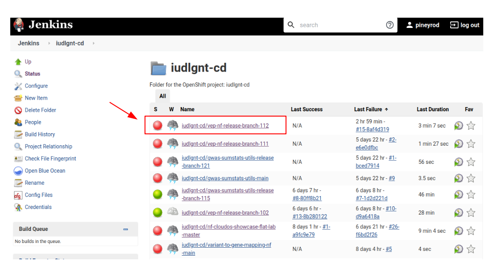
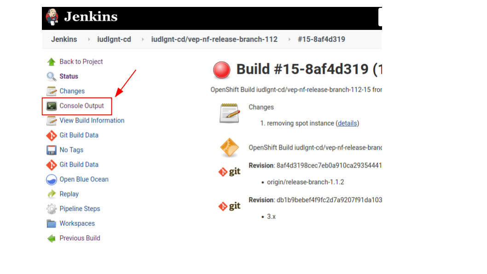

# BI Jenkins CI test

The following document describes the implemented BI Jenkins CI tests for the
pipeline as well as its components and requirements.

## Overview

CI tests (Continuous Integration tests) aim to test the software integrity
and they are a common tool managing and maintaining big software development
projects. They are focused in testing the application globally, end-to-end,
trying to cover as many configurations and running modes
as possible.

In this context, BI (Boehringer Ingelheim) has implemented and automated
their CI tests using **Bitbucket** repositories and **Jenkins** automation server.

For the Lifebit-BI pipelines, the key pieces for this CI testing
automation are the following:

- BI Bitbucket repo: accessible [here](https://bitbucket.biscrum.com/projects/IUDLGNT/repos),
it is pre-configured to trigger Jenkins CI tests at every new commit.
- Jenkins server: accessible [here](https://jenkins-iudlgnt-cd.apps.eu-dev.ocp.aws.boehringer.com/), only from inside
BI system, it is a server based service that is able to run services and containers
specified in a given `Jenkinsfile`.
- `Jenkinsfile`: a script (text file) containing the CI test
instructions (see [Jenkinsfile](#jenkinsfile)).
- BI - CloudOS: all the CI tests for Lifebit-BI pipelines are meant
to run in a particular BI-CloudOS. The available CloudOS environments are:
    * Prod: https://prod.cloudos.aws.boehringer.com
    * Dev: https://dev.cloudos.aws.boehringer.com

> NOTE: these BI-CloudOS environments are only accessible from inside
BI systems (e.g. using a Citrix Virtual Machine [as here](https://myworkspace-eu.boehringer-ingelheim.com/vpn/index.html)).

> NOTE2: all the provided URLs require personal authentication and
credentials granted by BI IT personnel.

The following diagram exemplifies the workflow of a regular CI test:


## BI Bitbucket repositories

You can check CI status for each of the desired commits using the "Builds" button:


> VERY IMPORTANT: in order to properly run your tests in CloudOS you have to set the branch that you want to test as the
**default** branch of the repository.

## Jenkins server

To check the Console Output generated by a particular commit CI test, you can access
[Jenkins server](https://jenkins-iudlgnt-cd.apps.eu-dev.ocp.aws.boehringer.com/)
and proceed as it is shown in the following screenshots:





## Jenkinsfile
<a name="jenkinsfile"></a>

Most of the `Jenkinsfile` code is already provided by a Bitbucket automation
as boilerplate code. It is placed in the root directory of the repository. The most
important parts are:

**1. CloudOS variable definitions:** defining CloudOS parameters to run jobs.
This is **the only section** of the Jenkinsfile that needs to be adapted to each specific CI test.

```
/*
Parameters related to CloudOS run
*/

// [REQUIRED] Pipeline specific variables - must be updated
CLOUDOS_WORKFLOW_NAME = "iudlgnt-gwas-sumstats-utils"

// Test profiles
CLOUDOS_PROFILE_1="network_cloudos,test_ebi_basic_cloudos"
CLOUDOS_PROFILE_2="network_cloudos,test_ieu_cloudos"

CLOUDOS_PROFILE_LIST="$CLOUDOS_PROFILE_1 $CLOUDOS_PROFILE_2"

// [REQUIRED] Environment Specific Variables - must be updated
CLOUDOS_URL = "https://prod.cloudos.aws.boehringer.com"
CLOUDOS_WORKSPACE_ID = "620fc193a487941c70e8a2b0"
//CLOUD_OS_TOKEN = "xxxx" // don't define! This is stored as a secret env in OpenShift

// [OPTIONAL] Variables with sensible defaults - could be optionally parameters
CLOUDOS_PROJECT_NAME = "JenkinsCI" // the project must already exist in the workspace
CLOUDOS_INSTANCE_TYPE="m5.2xlarge"
```

Pay special attention to the profiles section. Each of your separated CI test jobs should be a combination of 1 or more
profiles in a `CLOUDOS_PROFILE_X` variable (comma-separated if there is more than one profile per job). Then,
be sure that you have included all your CI runs (`CLOUDOS_PROFILE_X`) in the `CLOUDOS_PROFILE_LIST` variable,
separated by single spaces.

>NOTE: `CLOUD_OS_TOKEN` is already configured for "https://prod.cloudos.aws.boehringer.com" and is not required.

>NOTE2: the Jenkins job name will be automatically assigned as your profile/s for each job.

**2. Containers to run:** to define the `cloudos-py` docker container
to run the CI tests.

```
                  containerTemplate(
                    name: 'cloud-os',
                    image: "quay.io/lifebitai/cloudos-py:v0.0.8bi",
                    workingDir: '/tmp',
                    alwaysPullImage: true,
                    ttyEnabled: true,
                    command: 'sleep',
                    args: 'inf'
                  )
```

**3. Function to execute `cloudos-py` and output the results:** in this section, the
`cloudos job run` commands that are going to execute should be defined. This section should not be modified.

The following example runs two CloudOS jobs serially for testing the `bi-gwas-sumstats-harmonisation-nf`,
using the above specified variables:

```
private void runCloudOSJob(def context, String secretName){

  withEnv(["HTTP_PROXY=${env.HTTP_PROXY}", "HTTPS_PROXY=${env.HTTPS_PROXY}", "NO_PROXY=${env.NO_PROXY}",]) {
    withCredentials([
      string(credentialsId: secretName, variable: 'CLOUD_OS_TOKEN')
    ]){
      container('cloud-os'){
        output = sh(
          returnStdout: true,
          script:"""
            export HTTP_PROXY=http://appaccess-zscaler.boehringer.com:80 && \
            export HTTPS_PROXY=http://appaccess-zscaler.boehringer.com:80 && \
            export NO_PROXY=localhost,.boehringer.com,*.boehringer.com,10.,10.*,172.20.,172.20.*,0,1,2,3,4,5,6,7,8,9 && \
            GIT_COMMIT=`git log -n 1 --pretty=format:'%H'`
            for CLOUDOS_PROFILE in ${CLOUDOS_PROFILE_LIST}; do
                ${CLOUDOS_RUN_CMD} --nextflow-profile \${CLOUDOS_PROFILE} --job-name \${CLOUDOS_PROFILE} --git-commit \${GIT_COMMIT}
            done
            """).trim()

        }
        echo "XXXXXXXXXXXXXXX"
        echo "${output}"
        echo "XXXXXXXXXXXXXXX"
     }
  }
}
```

## Bi - CloudOS

To check your CI tests triggered using Jenkins, you can access the Citrix VM
using your personal credentials [here](https://myworkspace-eu.boehringer-ingelheim.com/vpn/index.html)
and, after authenticating and accessing the VM, you will find a regular Windows system.


Then, you can open the provided web browser and paste the CloudOS url you configured
in your Jenkinsfile.


Finally, you can check your CI test job as normally in CloudOS.


